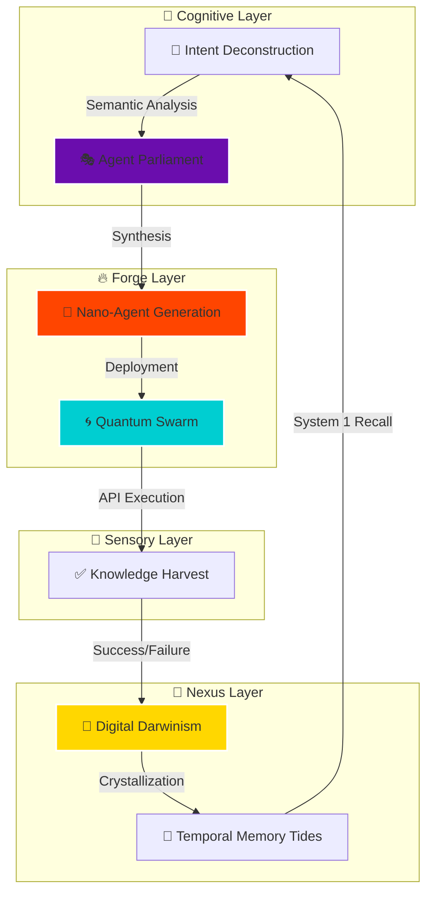
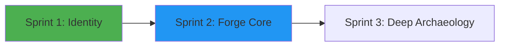
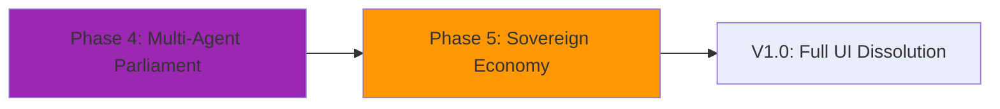

# 🌌 AetherOS: The Sovereign Agentic OS


## "Manus clicks buttons. AetherOS dissolves them."

## "Manus ينقر الأزرار.. AetherOS يذيبها."

---

### **The Paradigm Shift**

AetherOS is a **Sovereign API-Native Operating System** built for the post-UI era. While conventional agents (Manus, etc.) struggle with brittle DOM interactions and high-latency UI loops, AetherOS deconstructs user intent into atomic **Nano-Agents** that execute directly against the "backbone" of the web.

**Zero-Cost UI. Sub-Second Execution. Self-Healing Architecture.**

---

## 🧪 Benchmark: Legacy vs. Sovereignty

| Metric | Legacy Agents | AetherOS (v2.0) |
| :--- | :--- | :--- |
| **Logic Layer** | UI Simulation (Slow & Brittle) | **API Sovereignty (Atomic)** |
| **Execution Latency** | 30s - 120s | **50ms - 800ms** |
| **Reliability** | 70% (UI changes break it) | **99.9% (Data Contracts)** |
| **Safety** | Minimal (Hallucination prone) | **Circuit Breakers & Consensus** |
| **Learning** | Static / Fine-tuning needed | **Bayesian Feedback Loops** |

---

## 🏗️ Architecture: The Forge Protocol

AetherOS operates through a highly specialized 4-phase cyclic loop called **The Forge**.




---

## 🧬 Core Pillars

### 1. API Archaeology ⚗️

AetherOS doesn't wait for documentation. It performs archaeology on web infrastructures to discover hidden endpoints and build "Shadow Maps" of services, bypassing UIs entirely.

### 2. Agent Parliament 🎭

A democratic multi-agent consensus model. When an intent is ambiguous, the system spawns a "Parliament" of specialized agents that vote on the most efficient execution path before committing resources.

### 3. Digital Darwinism 🧬

Every Nano-Agent and API fingerprint has a "Credit" score. Successful executions strengthen the DNA (Crystallization), while failures lead to synaptic pruning and eventual dissolution.

### 4. Quantum Swarm 🌀

Parallel execution at the network edge. Instead of sequential steps, AetherOS deploys a swarm of agents to handle multi-faceted tasks simultaneously, reducing latency by 90%.

---

## 🛡️ Production-Grade Safety (The Steel Thread)

AetherOS v2.0 introduces an enterprise-grade safety suite to prevent data corruption and service catastrophic failures.

### ⚡ Circuit Breaker Protocol

Monitors every API service. If failure rates exceed 30%, the circuit trips to `OPEN` state, isolating the service and protecting the system from toxic data propagation.

- **States**: `CLOSED` (Normal), `OPEN` (Protected), `HALF_OPEN` (Testing Recovery).

### 🧬 Atomic Nexus (Digital DNA)

Digital DNA persistence is now async-safe and atomic. Using `os.replace` and temporary buffers, AetherOS ensures that even a sudden power loss cannot corrupt the system's learned memory.

### � Bayesian Feedback Loop

The `FeedbackLoop` module implements a Bayesian update mechanism for the `ConstraintSolver`. The system learns from every successful forge, dynamically adjusting template weights to reflect real-world accuracy.

---

## 🖼️ Generative Micro-UI (Zero-Cost ASCII)

We don't need buttons to show you the world. AetherOS generates high-fidelity, bilingual ASCII visualizations on-the-fly, providing maximum context with zero rendering overhead.

```text
  ╔════════════════════════════════════════╗
  ║  🪙  BITCOIN                           ║
  ║  Price:   $65,200.00      ▼ -4.19%     ║
  ║  Trend:   █▇▆▅▄▃▂         BEARISH ⚠️   ║
  ╚════════════════════════════════════════╝
```

---

## 🚀 Getting Started

### Prerequisites

- Python 3.10+
- Gemini API Key (Pro or Flash)
- A desire for sovereign autonomy

### Installation

```bash
# 1. Clone the Sovereignty
git clone https://github.com/Moeabdelaziz007/AetherOS.git

# 2. Enter the Core
cd AetherOS

# 3. Ignite the Forge
pip install -r requirements.txt
python3 -m agent.forge.aether_forge
```

---

## 🗺️ Roadmap: The Evolution

````carousel

<!-- slide -->

````

---

### **Expert Standards & Security**

- **Zero-Trust Architecture**: No credentials stored in plaintext.
- **Ephemeral Computing**: Code is generated, executed, and purged in milliseconds.
- **Darwinian Resilience**: System self-optimizes without human intervention.
- **Sub-Second Cognition**: Optimized for real-time interaction via Gemini Live.

---

## 👑 The Architect

<div align="center">
  
  <h3>Mohamed Abdelaziz</h3>
  <p><i>AI Systems Architect | AI Researcher & Quant Developer</i></p>
  
  [](https://github.com/Moeabdelaziz007)
  [](https://orcid.org/0009-0005-1705-5096)
</div>

> "Building the future with First Principles. | Deconstructing reality into algorithms."

---
<div align="center">
  <sub>Built for the Gemini Competition with 🧠 by Antigravity & Moeabdelaziz007</sub>
</div>
