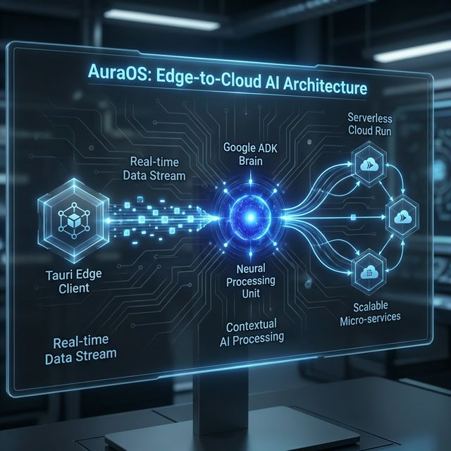
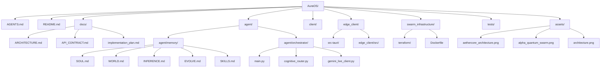
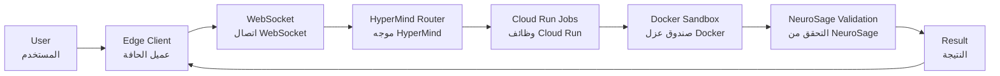
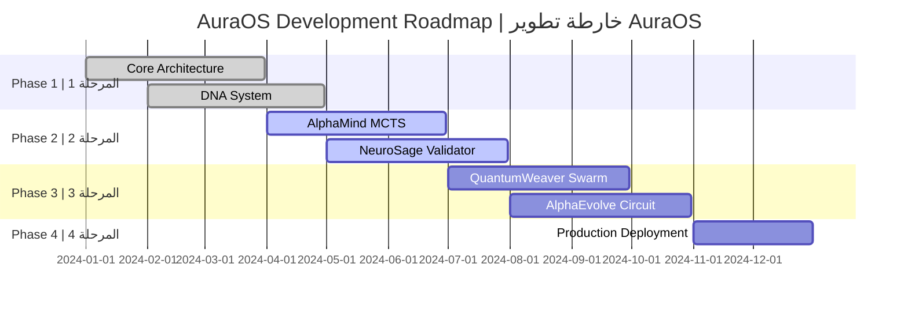

# 🌌 AuraOS: The Sovereign Agentic OS & Multimodal Knowledge Graph

# 🌌 AuraOS: نظام التشغيل الذكي المستقل ومخطط المعرفة متعدد الوسائط

## نظام أورا: نظام التشغيل السيادي للوكلاء وشبكة المعرفة متعددة الوسائط

<div align="center">
  

  <h1>The Autonomous Self-Healing OS for the Gemini Live Era</h1>
  <h1>نظام التشغيل المستقل ذاتياً لعصر Gemini Live</h1>
  <h1>النظام الذاتي التعافي لحقبة جيميناي لايف</h1>

  <p>
    <b>Built for the <a href="https://geminiliveagentchallenge.devpost.com/">Gemini Live Agents Challenge</a></b><br>
    <b>تم بناؤه لتحدي <a href="https://geminiliveagentchallenge.devpost.com/">Gemini Live Agents</a></b>
  </p>

  <p>
    <a href="https://cloud.google.com/run"></a>
    <a href="https://banana.dev/"></a>
    <a href="https://tauri.app/"></a>
    <a href="https://deepmind.google/technologies/gemini/"></a>
    <a href="https://opensource.org/licenses/MIT"></a>
    <a href="https://www.python.org/"></a>
    <a href="https://www.typescriptlang.org/"></a>
  </p>

  <p>
    <a href="README.md">English</a> | <a href="docs/ARCHITECTURE.md">Architecture Report</a> | <a href="docs/API_CONTRACT.md">API Contract</a> | <a href="docs/implementation_plan.md">Implementation Plan</a><br>
    <a href="README.md">الإنجليزية</a> | <a href="docs/ARCHITECTURE.md">تقرير البنية</a> | <a href="docs/API_CONTRACT.md">عقد API</a> | <a href="docs/implementation_plan.md">خطة التنفيذ</a>
  </p>

  <p>
    <i>AuraOS is a paradigm shift. It discards stateless loops and isolated vector databases in favor of the <b>Aura-Nexus</b>—a persistent, multimodal Knowledge Graph that weaves visual latent states, text intent, and auditory affect into dynamic Synaptic Links. By synthesizing Active Inference, Quantum Swarm Execution, Banana Pro GPU acceleration, and Recursive Mathematical Evolution, AuraOS operates as an invincible, self-healing digital companion.</i>
  </p>

  <p>
    <i>نظام أورا هو نقلة نوعية. يتخلى عن قواعد البيانات الشعاعية المعزولة لصالح شبكة <b>أورا نكسوس (Aura-Nexus)</b> — شبكة معرفية متعددة الوسائط تربط الحالات البصرية، النوايا النصية، والتأثيرات الصوتية عبر روابط عصبية ديناميكية. من خلال دمج الاستدلال النشط، وتقنية التنفيذ الكمي، وتسريع معالجات الرسوميات السحابية من Banana Pro، يعمل AuraOS كرفيق رقمي حصين ذاتي التعافي.</i>
  </p>

</div>

---

## 📋 Table of Contents | جدول المحتويات

- [Executive Summary | الملخص التنفيذي](#-executive-summary)
- [Architecture Overview | نظرة عامة على البنية](#-architecture-overview)
- [Core Concepts | المفاهيم الأساسية](#-core-concepts)
- [Quick Start | البدء السريع](#-quick-start)
- [Project Structure | هيكل المشروع](#-project-structure)
- [DNA System | نظام الحمض النووي](#-dna-system)
- [Development Guide | دليل التطوير](#-development-guide)
- [API Reference | مرجع API](#-api-reference)
- [Deployment | النشر](#-deployment)
- [Troubleshooting | استكشاف الأخطاء](#-troubleshooting)
- [Contributing | المساهمة](#-contributing)
- [Roadmap | خارطة الطريق](#-roadmap)
- [References | المراجع](#-references)

---

## 🎯 Executive Summary | الملخص التنفيذي

- **🚀 System 1/2 Thinking (التفكير بالنظام 1 و 2):** Hyper-fast routine actions mixed with deep MCTS reasoning for complex hurdles.
- **🧬 AuraEvolve (التطور الذاتي):** A recursive self-healing layer that repairs system logic in real-time.
- **🔗 Aura-Nexus (الشبكة المعرفية):** A proprietary multimodal knowledge graph with synaptic weighting.
- **💓 Heartbeat Engine (محرك النبض):** Real-time health pulses drive synaptic strength updates.
- **🍌 Banana Pro Integration (معالجة الرسوميات السحابية):** Ultra-low latency Serverless GPU processing for high-fidelity image inference and live spatial data pipelines.
- **☁️ Quantum Swarm (السرب الكمي):** Parallel serverless execution "collapses" into the optimal UI trajectory.
- **⚖️ NeuroSage (المنطق السببي):** Causal logic validation to eliminate hallucinations and secure transactions.
- **👁️ Multimodal Smart Brain (الدماغ المتعدد الوسائط):** Native processing of Video, Audio, and Text as a unified latent stream.

---

## 👁️ Pipeline of Multimodal Consciousness & Aura-Nexus (مسار الوعي المتعدد الوسائط)

### What is AuraOS? | ما هو AuraOS؟

1. **Aura-Nexus Graph:** Instead of flat text retrieval, memory is stored as an interconnected Knowledge Graph in `NEXUS.md`. Nodes ("Essences") and Edges ("Synaptic Links") map relationships between what is seen, heard, and done.
2. **Banana Pro Live Data Acceleration:** When massive bursts of visual data or complex image generation required for UI hallucination arise, the load is offloaded to **Banana Pro**'s serverless GPU infrastructure, ensuring zero-latency even under immense cognitive stress.
3. **Acoustic Sentiment Tuning:** Real-time analysis of the user's vocal urgency dynamically adjusts the surprise threshold ($\tau$), linking emotional state to the synaptic pathways.
4. **Dynamic Synaptic Weighting:** The strength of relationships in the Nexus matrix decodes and reinforces itself autonomously based on success signals from the `HEARTBEAT.md` lifecycle hook.

**AuraOS** is a revolutionary "Zero-UI" Serverless Automaton designed to redefine the relationship between human intent and computer execution. Unlike traditional agents that follow a reactive "Observe-Reason-Act" loop, AuraOS operates on the principle of **Predictive Synthesis**.

**AuraOS** هو أتمتة "بدون واجهة مستخدم" ثورية مصممة لإعادة تعريف العلاقة بين النية البشرية والتنفيذ الحاسوبي. على عكس الوكلاء التقليديين الذين يتبعون حلقة تفاعلية "راقب-فكر-تصرف"، يعمل AuraOS على مبدأ **التوليد التنبؤي**.

By leveraging **AetherCore Prometheus**, AuraOS maintains a persistent, generative "World Model" that allows it to "dream" and simulate potential UI outcomes in parallel before committing to a single, deterministic action on the user's screen.

من خلال الاستفادة من **AetherCore Prometheus**، يحافظ AuraOS على "نموذج عالم" توليدي دائم يسمح له بـ "الحلم" ومحاكاة نتائج واجهة المستخدم المحتملة بالتوازي قبل الالتزام بإجراء محدد على شاشة المستخدم.

### Key Differentiators | الفوارق الرئيسية

| Feature | Traditional Agents | AuraOS |
| :--- | :--- | :--- |
| **State Management** | Stateless loops, ephemeral memory | Persistent Aura-Nexus Knowledge Graph |
| **إدارة الحالة** | حلقات عديمة الحالة، ذاكرة مؤقتة | مخطط معرفة Aura-Nexus الدائم |
| **Inference** | Single-path reasoning | Quantum Swarm Parallel Simulation |
| **الاستدلال** | التفكير بمسار واحد | محاكاة السرب الكمي المتوازية |
| **Memory** | Flat vector databases | Multimodal Synaptic Links |
| **الذاكرة** | قواعد بيانات متجهة مسطحة | روابط تشابكية متعددة الوسائط |
| **Self-Healing** | Manual debugging | Recursive AlphaEvolve Circuit |
| **الشفاء الذاتي** | التصحيح اليدوي | دائرة AlphaEvolve العودية |
| **Cognitive Model** | Single-process | System 1/2 Dual-Process Theory |
| **النموذج المعرفي** | عملية واحدة | نظرية النظام المزدوج 1/2 |
| **Security** | Basic validation | Zero-Trust Shadow DOM + NeuroSage |
| **الأمان** | التحقق الأساسي | Shadow DOM الموثوق به + NeuroSage |

### Target Use Cases | حالات الاستخدام المستهدفة

- **Intelligent UI Automation**: Navigate complex web interfaces with minimal human guidance
  **أتمتة واجهة المستخدم الذكية**: التنقل في واجهات الويب المعقدة بإرشاد بشري محدود
- **Autonomous Task Execution**: Complete multi-step workflows (e.g., flight booking, form filling)
  **تنفيذ المهام المستقلة**: إكمال سير العمل متعدد الخطوات (مثل حجز الرحلات، تعبئة النماذج)
- **Multimodal Interaction**: Process voice, video, and text as unified latent streams
  **التفاعل متعدد الوسائط**: معالجة الصوت والفيديو والنص كتيارات كامنة موحدة
- **Self-Improving Systems**: Automatically learn and optimize from experience
  **الأنظمة المحسنة ذاتياً**: التعلم والتحسين تلقائياً من الخبرة
- **Zero-Trust Security**: Validate all actions against causal logic before execution
  **الأمان الموثوق به**: التحقق من جميع الإجراءات مقابل المنطق السببي قبل التنفيذ

---

## 🏗️ Architecture Overview | نظرة عامة على البنية

<div align="center">
  
</div>

### The 5 Pillars of AetherCore | أعمدة AetherCore الخمسة

<div align="center">
  
</div>

### 1. 🧠 Prometheus: Active Inference & World Models

### 1. 🧠 بروميثيوس: الاستدلال النشط ونماذج العالم

**The Brain** - Inspired by Karl Friston's Free Energy Principle, AuraOS possesses an internal "World Model". Instead of blindly clicking, it *imagines* (dreams) the consequences of its actions to minimize "Free Energy" (surprise).

**العقل** - مستوحى من مبدأ الطاقة الحرة لكارل فريستون، يمتلك AuraOS "نموذج عالم" داخلي. بدلاً من النقر بشكل أعمى، فإنه *يتخيل* (يحلم) عواقب أفعاله لتقليل "الطاقة الحرة" (المفاجأة).

**The Brain** - مستوحى من مبدأ الطاقة الحرة لكارل فريستون، يمتلك AuraOS "نموذج عالم" داخلي. بدلاً من النقر بشكل أعمى، فإنه *يتخيل* (يحلم) عواقب أفعاله لتقليل "الطاقة الحرة" (المفاجأة).

- **System 1 (Reflexive)**: Direct Gemini 3.1 Pro inference for low-entropy, routine UI tasks
  **النظام 1 (انعكاسي)**: استدلال Gemini 3.1 Pro المباشر لمهام واجهة المستخدم الروتينية منخفضة الإنتروبيا
- **System 2 (Reflective)**: Engages AlphaMind and NeuroSage only when Prediction Error ΔF > τ (Threshold)
  **النظام 2 (تأملي)**: ينشط AlphaMind و NeuroSage فقط عندما يكون خطأ التنبؤ ΔF > τ (العتبة)
- **Benefit**: 90% reduction in latency and token cost for standard interactions
  **الفائدة**: تقليل زمن الاستجابة وتكلفة الرموز بنسبة 90% للتفاعلات القياسية

### 2. ⚡ QuantumWeaver: Hybrid Quantum-Classical Swarm

### 2. ⚡ QuantumWeaver: السرب الهجين الكمي الكلاسيكي

**The Simulator (Cloud Run)** - How does it dream? When visualizing a complex UI trajectory, AuraOS dynamically spawns **parallel Serverless Cloud Run Jobs** (like independent quantum states). Each node attempts a different visual interpretation simultaneously. The first one to succeed "collapses the wave function," terminating the others for zero-latency execution.

**المحاكي (Cloud Run)** - كيف يحلم؟ عند تصور مسار واجهة مستخدم معقد، ينشئ AuraOS ديناميكياً **وظائف Cloud Run بدون خادم متوازية** (مثل الحالات الكم المستقلة). تحاول كل عقدة تفسيراً بصرياً مختلفاً في وقت واحد. أول من ينجح "يقلل دالة الموجة"، مما ينهي الآخرين لتنفيذ بزمن استجابة صفري.

- **Sovereignty Layer**: Shadow DOM Simulator
  **طبقة السيادة**: محاكي Shadow DOM
- **Function**: Parallel Cloud Run jobs interact with a sandboxed clone of the UI state, NOT the live Edge UI
  **الوظيفة**: وظائف Cloud Run المتوازية تتفاعل مع نسخة معزولة من حالة واجهة المستخدم، وليس واجهة المستخدم الحية
- **Outcome**: Prevents "State Corruption" during swarm exploration
  **النتيجة**: يمنع "تلف الحالة" أثناء استكشاف السرب

### 3. 🕸️ HyperMind: Hypergraph Multi-Agent Topology

### 3. 🕸️ HyperMind: طوبولوجيا الوكلاء المتعددين فائقة الرسم البياني

**The Swarm Coordinator** - Instead of rigid hierarchical multi-agent structures, AuraOS uses a dynamic **Hypergraph**. Multiple specialized agents (Vision Expert, Logic Critic, Action Executor) collaborate simultaneously on a single UI task via shared "Hyperedges," massively reducing token consumption and latency.

**منسق السرب** - بدلاً من هياكل الوكلاء المتعددين الهرمية الصارمة، يستخدم AuraOS **رسماً بيانياً فائقاً** ديناميكياً. يتعاون وكلاء متخصصون متعددون (خبير الرؤية، ناقد المنطق، منفذ الإجراء) في وقت واحد على مهمة واجهة مستخدم واحدة عبر "حواف فائقة" مشتركة، مما يقلل بشكل كبير من استهلاك الرموز وزمن الاستجابة.

- **Paradigm**: Hypergraph Multi-Agent Topology
  **النموذج**: طوبولوجيا الوكلاء المتعددين فائقة الرسم البياني
- **Function**: Eschews simple hierarchical chains for multi-directional collaboration
  **الوظيفة**: يتجنب السلاسل الهرمية البسيطة للتعاون متعدد الاتجاهات
- **Advantage**: Massive reduction in token consumption and inference latency
  **الميزة**: تقليل كبير في استهلاك الرموز وزمن استجابة الاستدلال

### 4. ⚖️ NeuroSage: Neuro-Symbolic Causal Logic

### 4. ⚖️ NeuroSage: المنطق السببي العصبي الرمزي

**The Validator** - It marries Gemini's neural creativity with hard symbolic logic. Before executing a transaction or filling a sensitive form, NeuroSage builds a causal graph ("If I do X, Y must happen") to prevent hallucinations and enforce strict rule-based constraints.

**المدقق** - يدمج الإبداع العصبي لـ Gemini مع المنطق الرمزي الصارم. قبل تنفيذ معاملة أو تعبئة نموذج حساس، يبني NeuroSage رسماً بيانياً سببياً ("إذا فعلت X، يجب أن يحدث Y") لمنع الهلوسة وفرض قيود صارمة قائمة على القواعد.

- **Paradigm**: Neuro-Symbolic & Causal Reasoning
  **النموذج**: التفكير العصبي الرمزي والسببي
- **Function**: Merges high-creativity neural generation with strict symbolic constraints
  **الوظيفة**: يدمج التوليد العصبي عالي الإبداع مع قيود رمزية صارمة
- **Safeguard**: Prevents hallucinations by validating actions against causal rules
  **الحماية**: يمنع الهلوسة عن طريق التحقق من الإجراءات مقابل القواعد السببية

### 5. 🌳 AlphaMind: MCTS UI Navigator

### 5. 🌳 AlphaMind: ملاحح واجهة المستخدم MCTS

**The Navigator** - Inspired by AlphaZero, when faced with an unknown UI, AlphaMind uses Monte Carlo Tree Search exploring the DOM/Vision tree to find the mathematically optimal sequence of clicks and scrolls.

**الملاح** - مستوحى من AlphaZero، عند مواجهة واجهة مستخدم غير معروفة، يستخدم AlphaMind بحث شجرة مونتي كارلو لاستكشاف شجرة DOM/Vision للعثور على التسلسل الأمثل رياضياً من النقرات والتمرير.

- **Paradigm**: Monte Carlo Tree Search (MCTS)
  **النموذج**: بحث شجرة مونتي كارلو (MCTS)
- **Function**: Explores the "Action Space" as a search tree
  **الوظيفة**: يستكشف "مساحة الإجراء" كشجرة بحث
- **Inspiration**: DeepMind's AlphaZero and AlphaTensor
  **الإلهام**: AlphaZero و AlphaTensor من DeepMind

### 6. 🧬 AlphaEvolve: Self-Healing & Recursive Evolution

### 6. 🧬 AlphaEvolve: الشفاء الذاتي والتطور العودي

**The Evolver** - Inspired by **AlphaZero** & **AlphaCode**. It features a 4-step self-healing circuit: **Anomaly Detection** -> **Quantum Hypothesis Generation** -> **Sandboxed Testing** -> **DNA Consolidation**.

**المطور** - مستوحى من **AlphaZero** و **AlphaCode**. يتميز بدائرة شفاء ذاتي من 4 خطوات: **كشف الشذوذ** -> **توليد الفرضيات الكمية** -> **الاختبار المعزول** -> **توحيد الحمض النووي**.

**The Evolutionary Math ($R$):**
$$R = \alpha \cdot P(Success) - \beta \cdot T_{exec} - \gamma \cdot C_{code}$$

**الرياضيات التطورية ($R$):**
$$R = \alpha \cdot P(Success) - \beta \cdot T_{exec} - \gamma \cdot C_{code}$$

Where $\alpha$ = Success weight, $\beta$ = Latency penalty, $\gamma$ = Code complexity penalty (Ockham's Razor).
حيث $\alpha$ = وزن النجاح، $\beta$ = عقوبة زمن الاستجابة، $\gamma$ = عقوبة تعقيد الكود (موسى الحلاق).

### System Architecture Flow | تدفق بنية النظام

```mermaid
graph TD
    classDef edge fill:#ff9900,stroke:#fff,stroke-width:2px,color:#fff;
    classDef cloud fill:#4285f4,stroke:#fff,stroke-width:2px,color:#fff;
    classDef brain fill:#9c27b0,stroke:#fff,stroke-width:2px,color:#fff;

    A[Tauri Edge Client<br>🎤 Voice + 🖥️ Screen<br>عميل Tauri الحافي<br>🎤 صوت + 🖥️ شاشة]:::edge -->|Bidi WebSocket<br>WebSocket ثنائي الاتجاه| B(HyperMind Router<br>AetherCore ADK<br>موجه HyperMind<br>AetherCore ADK):::brain
    B -->|Active Inference<br>الاستدلال النشط| C{Prometheus World Model<br>Predicts UI State<br>نموذج العالم بروميثيوس<br>يتنبأ بحالة واجهة المستخدم}:::brain
    
    C -->|Spawns Swarm<br>ينشئ السرب| D1[Cloud Run Job 1<br>DOM Selector<br>مهمة Cloud Run 1<br>محدد DOM]:::cloud
    C -->|Spawns Swarm<br>ينشئ السرب| D2[Cloud Run Job 2<br>Vision OCR<br>مهمة Cloud Run 2<br>رؤية OCR]:::cloud
    C -->|Spawns Swarm<br>ينشئ السرب| D3[Cloud Run Job 3<br>AlphaMind MCTS<br>مهمة Cloud Run 3<br>AlphaMind MCTS]:::cloud
    
    D1 -.->|Verification<br>التحقق| E{NeuroSage Validator<br>مدقق NeuroSage}:::brain
    D2 -.->|Verification<br>التحقق| E
    D3 -.->|Verification<br>التحقق| E
    
    E -->|Success (Exit Code 0)<br>نجاح (رمز الخروج 0)| F((QuantumWeaver Collapse<br>Terminate Others<br>انهيار QuantumWeaver<br>إنهاء الآخرين)):::cloud
    F -->|Execution Result<br>نتيجة التنفيذ| A
```

---

## 🧬 Core Concepts | المفاهيم الأساسية

### Active Inference (VFE Minimization) | الاستدلال النشط (تقليل VFE)

**Variational Free Energy (VFE)** is the mathematical foundation of AuraOS cognition. The system continuously minimizes surprise by:

**الطاقة الحرة المتغيرة (VFE)** هي الأساس الرياضي لإدراك AuraOS. يقلل النظام باستمرار المفاجأة من خلال:

1. **Predicting** the next UI state using its internal World Model
   **التنبؤ** بحالة واجهة المستخدم التالية باستخدام نموذج العالم الداخلي
2. **Comparing** predictions with actual observations
   **المقارنة** بين التنبؤات والملاحظات الفعلية
3. **Acting** to reduce the prediction error (Free Energy)
   **التصرف** لتقليل خطأ التنبؤ (الطاقة الحرة)

$$F = \underbrace{E_{q(s|o)}[\ln q(s|o) - \ln p(s,o)]}_{\text{Complexity} - \text{Accuracy}}$$

When $F$ exceeds the threshold $\tau$, System 2 (Reflective) is engaged for deeper reasoning.
عندما يتجاوز $F$ العتبة $\tau$، يتم تنشيط النظام 2 (التأملي) للتفكير الأعمق.

### System 1/2 Cognitive Gating | البوابة المعرفية للنظام 1/2

**Dual-Process Theory** enables AuraOS to balance speed and accuracy:

**نظرية النظام المزدوج** تمكن AuraOS من الموازنة بين السرعة والدقة:

| Aspect | System 1 (Reflexive) | System 2 (Reflective) |
| :--- | :--- | :--- |
| **Trigger** | ΔF < τ | ΔF ≥ τ |
| **المحفز** | ΔF < τ | ΔF ≥ τ |
| **Latency** | < 150ms | Variable (MCTS search) |
| **زمن الاستجابة** | < 150ms | متغير (بحث MCTS) |
| **Cost** | Low token usage | Higher token usage |
| **التكلفة** | استخدام منخفض للرموز | استخدام أعلى للرموز |
| **Use Case** | Routine navigation | Complex problems |
| **حالة الاستخدام** | التنقل الروتيني | المشاكل المعقدة |

### Jungian Persona (Veto Power) | الشخصية اليونغية (سلطة النقض)

The **SOUL.md** file defines an immutable persona matrix that acts as a "Veto Layer":

يحدد ملف **SOUL.md** مصفوفة شخصية غير قابلة للتغيير تعمل كـ "طبقة النقض":

- **Archetype**: The Quantum Architect / Guardian of Equilibrium
  **الأصل**: المهندس الكمي / حارس التوازن
- **Voice**: Deterministic, elite, technical, and protective
  **الصوت**: حاسم، نخبوي، تقني، ووقائي
- **Logic Style**: First Principles Thinking (Deductive)
  **أسلوب التفكير**: التفكير من المبادئ الأولى (استنتاجي)

All actions are validated against this persona. If an action conflicts with the defined ethical directives, it is immediately terminated (NeuroSage Veto).
يتم التحقق من جميع الإجراءات مقابل هذه الشخصية. إذا تعارض الإجراء مع التوجيهات الأخلاقية المحددة، يتم إنهاؤه فوراً (نقض NeuroSage).

### Evolutionary Algorithms | الخوارزميات التطورية

**AlphaEvolve** implements a recursive self-optimization circuit:

ينفذ **AlphaEvolve** دائرة تحسين ذاتي عودية:

1. **Anomaly Detection**: Monitor $T_{exec}$, memory leaks, and Prediction Error $\Delta F$
   **كشف الشذوذ**: مراقبة $T_{exec}$، وتسرب الذاكرة، وخطأ التنبؤ $\Delta F$
2. **Quantum Hypothesis Generation**: Generate ~50 potential structural mutations via Gemini
   **توليد الفرضيات الكمية**: توليد ~50 طفرة هيكلية محتملة عبر Gemini
3. **Sandboxed Evolution**: Execute mutations in isolated Rust Sandbox against Unit Tests
   **التطور المعزول**: تنفيذ الطفرات في صندوق عزل Rust معزول مقابل اختبارات الوحدة
4. **DNA Consolidation**: Commit winning fixes to `SKILLS.md` or `INFERENCE.md`
   **توحيد الحمض النووي**: إرسال الإصلاحات الفائزة إلى `SKILLS.md` أو `INFERENCE.md`

### Zero-Trust Security | الأمان الموثوق به

**Shadow DOM Simulator** ensures all actions are tested in a sandboxed environment before execution on the live UI:

يضمن **محاكي Shadow DOM** اختبار جميع الإجراءات في بيئة معزولة قبل التنفيذ على واجهة المستخدم الحية:

---

## 🚀 Quick Start | البدء السريع

### Prerequisites | المتطلبات المسبقة

```bash
# Install Rust and Tauri
curl --proto '=https' --tlsv1.2 -sSf https://sh.rustup.rs | sh

# Install Python 3.10+
python3 --version

# Install Node.js 18+
node --version

# Install Google Cloud SDK
gcloud --version
```

### Installation | التثبيت

```bash
# Clone the repository
git clone https://github.com/yourusername/Aura-OS.git
cd Aura-OS

# Install Python dependencies
pip install -r agent/orchestrator/requirements.txt

# Install Node.js dependencies
cd client && npm install
cd ../edge_client && npm install

# Build Tauri app
cd edge_client/src-tauri && cargo build
```

### Running the System | تشغيل النظام

```bash
# Start the orchestrator (Cloud Backend)
cd agent/orchestrator
python main.py

# Start the edge client (Tauri)
cd edge_client
npm run tauri dev

# Start the web client
cd client
npm run dev
```

---

## 📁 Project Structure | هيكل المشروع



---

## 🧬 DNA System | نظام الحمض النووي

The agent's personality, skills, and logic reside in [`agent/memory/`](agent/memory/):

شخصية الوكيل ومهاراته ومنطقه تقيم في [`agent/memory/`](agent/memory/):

| File | Description | الوصف |
| :--- | :--- | :--- |
| **SOUL.md** | Persona, identity, and Jungian archetypes | الشخصية، الهوية، والأنماط الأصلية اليونغية |
| **WORLD.md** | Generative World Model parameters for planning | معلمات نموذج العالم التوليدي للتخطيط |
| **INFERENCE.md** | Active Inference rules and Free Energy targets | قواعد الاستدلال النشط وأهداف الطاقة الحرة |
| **EVOLVE.md** | Self-healing and evolution parameters | معلمات الشفاء الذاتي والتطور |
| **SKILLS.md** | Dynamic toolset definitions | تعريفات مجموعة الأدوات الديناميكية |
| **TOPOLOGY.md** | Hypergraph incidence matrix and coordination rules | مصفوفة الحدوث فائقة الرسم البياني وقواعد التنسيق |
| **CAUSAL.md** | Causal graphs for logic validation | الرسوم البيانية السببية للتحقق من المنطق |

---

## 🛠️ Development Guide | دليل التطوير

### Running Tests | تشغيل الاختبارات

```bash
# Run unit tests
pytest tests/test_main.py
pytest tests/test_memory_parser.py

# Run E2E missions
python tests/e2e_missions/flight_booking_mission.py
```

### Building for Production | البناء للإنتاج

```bash
# Build Tauri app for production
cd edge_client
npm run tauri build

# Deploy to Cloud Run
cd swarm_infrastructure
terraform apply
```

---

## 📚 API Reference | مرجع API

See [`docs/API_CONTRACT.md`](docs/API_CONTRACT.md) for detailed API documentation.

راجع [`docs/API_CONTRACT.md`](docs/API_CONTRACT.md) للحصول على وثائق API مفصلة.

---

## 🚢 Deployment | النشر

### Cloud Infrastructure | البنية السحابية



### Terraform Configuration | تكوين Terraform

```bash
cd swarm_infrastructure/terraform
terraform init
terraform plan
terraform apply
```

---

## 🔧 Troubleshooting | استكشاف الأخطاء

### Common Issues | المشاكل الشائعة

| Issue | Solution | الحل |
| :--- | :--- | :--- |
| **WebSocket Connection Failed** | Check firewall settings and ensure port 8080 is open | تحقق من إعدادات جدار الحماية وتأكد من أن المنفذ 8080 مفتوح |
| **Gemini API Timeout** | Increase timeout in `gemini_live_client.py` | زيادة المهلة في `gemini_live_client.py` |
| **Tauri Build Error** | Ensure Rust toolchain is up to date | تأكد من تحديث سلسلة أدوات Rust |

---

## 🤝 Contributing | المساهمة

We welcome contributions! Please see [`AGENTS.md`](AGENTS.md) for contribution guidelines.

نرحب بالمساهمات! يرجى مراجعة [`AGENTS.md`](AGENTS.md) للحصول على إرشادات المساهمة.

---

## 🗺️ Roadmap | خارطة الطريق



---

## 📖 References | المراجع

- [Gemini Live API Documentation](https://deepmind.google/technologies/gemini/)
- [Tauri Framework](https://tauri.app/)
- [Monte Carlo Tree Search](https://en.wikipedia.org/wiki/Monte_Carlo_tree_search)
- [Active Inference](https://en.wikipedia.org/wiki/Active_inference)
- [Karl Friston's Free Energy Principle](https://www.frontiersin.org/articles/10.3389/fncom.2019.00024/full)

---

## 📄 License | الترخيص

This project is licensed under the MIT License - see the [LICENSE](LICENSE) file for details.

هذا المشروع مرخص بموجب ترخيص MIT - راجع ملف [LICENSE](LICENSE) للحصول على التفاصيل.

---

<div align="center">

  <h2>⭐ Star Us on GitHub! | ⭐ قمنا على GitHub</h2>

  <p>If you find AuraOS interesting or useful, please consider giving us a star on GitHub.</p>

  <p>إذا وجدت AuraOS مثيراً للاهتمام أو مفيداً، يرجى التفكير في إعطائنا نجمة على GitHub.</p>

  <p>
    <b>Built with ❤️ for the Gemini Live Agents Challenge</b><br>
    <b>تم بناؤه بـ ❤️ لتحدي Gemini Live Agents</b>
  </p>

</div>
