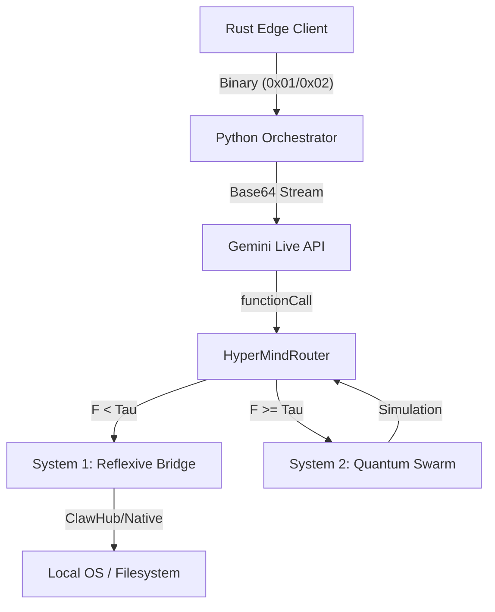

# 🤖 AGENTS.md: Meta-Protocol & Developer API

```yaml
version: 1.0.0
pillar: Prometheus (System Identity)
role: Sovereign_Developer_Interface
```

## 📡 Sensory-Cognitive Data Flow

This is the "Pipeline of Consciousness" in AetherOS. Follow this sequence for all system modifications:



## 🛡️ Safety Bench (Refactoring Rules)

To maintain **Zero-Latency** and **Deterministic Agency**, any agent (Human or AI) modifying the core must adhere to:

1. **Asynchronous Purity:**
   - NEVER use synchronous blocking calls (`time.sleep`, `requests.get`) in the Python event loop.
   - Use `asyncio.to_thread` for legacy sync libraries or `spawn_blocking` in Rust.

2. **Memory Consistency:**
   - The `AetherNavigator` uses `mmap`. Do not unmap or close file descriptors during runtime.
   - DNA updates must be incremental and hash-verified.

3. **Causal Integrity:**
   - Every new `SKILL` MUST be registered in `CAUSAL.md` as an intervention node.
   - Hallucinatory tool-calling is mitigated by the Causal Veto Check.

4. **Sensory Backpressure:**
   - In `vision.rs`, always prioritize the "Now". Drop oldest frames if the pipeline is saturated.

## 🧪 Intelligence Protocol

AetherOS is a **Self-Evolving System**. Modifications should prioritize:

- **Entropy Reduction:** Reducing $F$ (Variational Free Energy) over time.
- **Epistemic Value:** Expanding the Action Space through autonomous discovery in the `Evolution Sandbox`.

---
*AGENTS.md: The contract of the architects.*
