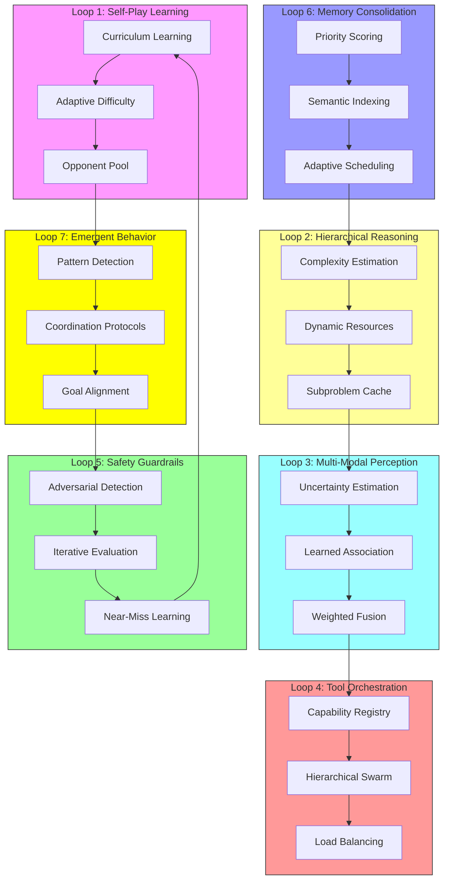

# AetherEvolve Omega: Revolutionary Self-Learning Voice-First Multi-Modal Agent System

## Executive Vision

This document presents the architectural blueprint for **AetherEvolve Omega**—a revolutionary voice-first AI agent system that transcends current paradigms by integrating:

1. **Zero-inspired-style self-play mastery** through self-generated training data
2. **Fold-inspired-inspired hierarchical reasoning** for complex task decomposition
3. **Distributed claw swarm coordination** for emergent task execution
4. **Continuous self-improvement** through environmental interaction and reflection
5. **Adaptive meta-improvement loops** for continuous architectural evolution

The system achieves **emergent conversational intelligence** that improves with every interaction.

---

## 1. System Architecture Overview

```
┌─────────────────────────────────────────────────────────────────────────────────────┐
│                        AETHEREVOLVE OMEGA: THE VOICE COGNITION ENGINE              │
├─────────────────────────────────────────────────────────────────────────────────────┤
│  MULTI-MODAL PERCEPTION LAYER                                                       │
│  ┌──────────┐ ┌──────────┐ ┌──────────┐ ┌──────────┐ ┌─────────────────┐         │
│  │ Voice    │ │ Vision   │ │ Video    │ │ Ambient  │ │ Cross-Modal    │         │
│  │ Stream   │ │ Encoder  │ │ Reasoner │ │ Listener │ │ Fusion +       │         │
│  │ + Uncertainty │ │ + Uncertainty │         │         │ │ Association    │         │
│  └────┬─────┘ └────┬─────┘ └────┬─────┘ └────┬─────┘ └────────┬────────┘         │
│       │            │            │            │                 │                  │
│       ▼            ▼            ▼            ▼                 ▼                  │
│  ┌─────────────────────────────────────────────────────────────────────┐         │
│  │              UNIFIED PERCEPTUAL EMBEDDING SPACE                      │         │
│  │     (Voice + Vision + Text → 4096-dim semantic manifold)            │         │
│  │         + Uncertainty Quantification for Robustness                │         │
│  └─────────────────────────────────────────────────────────────────────┘         │
└─────────────────────────────────────────────────────────────────────────────────────┘
                                       │
                                       ▼
┌─────────────────────────────────────────────────────────────────────────────────────┐
│                     HIERARCHICAL REASONING ENGINE                                  │
│  ┌─────────────────────────────────────────────────────────────────────┐         │
│  │                    FOLD-STYLE-STYLE TRANSFORMER                       │         │
│  │  ┌─────────────┐ ┌─────────────┐ ┌─────────────┐ ┌─────────────┐  │         │
│  │  │ Task        │ │ Context     │ │ Memory      │ │ Tool        │  │         │
│  │  │ Decomposer  │ │ Aggregator  │ │ Attention   │ │ Planner     │  │         │
│  │  │ + Dynamic   │ │ + Uncertainty│ │ + Semantic  │ │             │  │         │
│  │  │   Complexity│ │   Aware     │ │   Index     │ │             │  │         │
│  │  └─────────────┘ └─────────────┘ └─────────────┘ └─────────────┘  │         │
│  │         │               │               │               │              │         │
│  │         └───────────────┴───────────────┴───────────────┘          │         │
│  │                         ▼                                           │         │
│  │              ┌─────────────────────────────┐                        │         │
│  │              │  EVO-NTM: Evolutionary     │                        │         │
│  │              │  Neural Turing Machine     │                        │         │
│  │              │  (Self-Improving Memory)   │                        │         │
│  │              │  + Priority Consolidation  │                        │         │
│  │              └─────────────────────────────┘                        │         │
│  └─────────────────────────────────────────────────────────────────────┘         │
└─────────────────────────────────────────────────────────────────────────────────────┘
                                       │
                                       ▼
┌─────────────────────────────────────────────────────────────────────────────────────┐
│                     SELF-PLAY LEARNING LAYER                                     │
│  ┌─────────────────────────────────────────────────────────────────────┐         │
│  │                    ZERO-AGENT AGENT CORE                             │         │
│  │  ┌─────────────┐ ┌─────────────┐ ┌─────────────┐ ┌─────────────┐  │         │
│  │  │ MCTS        │ │ Self-Play   │ │ Value       │ │ Policy      │  │         │
│  │  │ Tree Search │ │ + Curriculum│ │ Network     │ │ Network     │  │         │
│  │  │             │ │   Adaptive  │ │             │ │             │  │         │
│  │  └─────────────┘ └─────────────┘ └─────────────┘ └─────────────┘  │         │
│  │         │               │               │               │              │         │
│  │         └───────────────┴───────────────┴───────────────┘          │         │
│  │                         ▼                                           │         │
│  │              ┌─────────────────────────────┐                        │         │
│  │              │  NOVELTY DETECTOR            │                        │         │
│  │              │  (Discover → Evaluate →      │                        │         │
│  │              │   Crystallize New Patterns)   │                        │         │
│  │              └─────────────────────────────┘                        │         │
│  └─────────────────────────────────────────────────────────────────────┘         │
└─────────────────────────────────────────────────────────────────────────────────────┘
                                       │
                                       ▼
┌─────────────────────────────────────────────────────────────────────────────────────┐
│                     TOOL ORCHESTRATION LAYER                                     │
│  ┌──────────────┐ ┌──────────────┐ ┌──────────────┐ ┌──────────────────┐        │
│  │ Tool         │ │ API          │ │ Code         │ │ Distributed      │        │
│  │ Discovery    │ │ Executor     │ │ Generator    │ │ Swarm Controller │        │
│  │ + Capability │ │              │ │              │ │ + Hierarchical   │        │
│  │   Registry   │ │              │ │              │ │   + Load Balance│        │
│  └──────────────┘ └──────────────┘ └──────────────┘ └──────────────────┘        │
└─────────────────────────────────────────────────────────────────────────────────────┘
                                       │
                                       ▼
┌─────────────────────────────────────────────────────────────────────────────────────┐
│                     SAFETY & GOVERNANCE LAYER                                    │
│  ┌──────────────┐ ┌──────────────┐ ┌──────────────┐ ┌──────────────────┐        │
│  │ Constitutional│ │ Privacy     │ │ Bias         │ │ Resource         │        │
│  │ AI Guardrails │ │ Shield      │ │ Detector     │ │ Governor         │        │
│  │ + Adaptive   │ │              │ │              │ │                  │        │
│  │   + Iterative│ │              │ │              │ │                  │        │
│  └──────────────┘ └──────────────┘ └──────────────┘ └──────────────────┘        │
└─────────────────────────────────────────────────────────────────────────────────────┘
                                       │
                                       ▼
┌─────────────────────────────────────────────────────────────────────────────────────┐
│                     EMERGENT BEHAVIOR COORDINATION LAYER                         │
│  ┌──────────────┐ ┌──────────────┐ ┌──────────────┐ ┌──────────────────┐        │
│  │ Pattern      │ │ Coordination │ │ Emergence    │ │ Goal             │        │
│  │ Detector     │ │ Protocols    │ │ Learner      │ │ Aligner          │        │
│  └──────────────┘ └──────────────┘ └──────────────┘ └──────────────────┘        │
└─────────────────────────────────────────────────────────────────────────────────────┘
```

---

## 2. Multi-Modal Perception Layer

### 2.1 Real-Time Voice Stream Processor

```python
# agent/orchestrator/modules/voice/omega_voice_engine.py

import asyncio
import numpy as np
from typing import AsyncGenerator, Dict, List, Optional, Tuple
from dataclasses import dataclass
import torch

@dataclass
class VoiceEmbedding:
    """Unified voice embedding combining acoustic and semantic features."""
    acoustic: np.ndarray      # 128-dim acoustic features
    semantic: np.ndarray       # 768-dim BERT-style embeddings
    prosodic: np.ndarray      # 32-dim prosody (pitch, energy, rhythm)
    emotional: np.ndarray     # 64-dim emotion vector
    uncertainty: np.ndarray   # 32-dim uncertainty (NEW: for robustness)
    timestamp: float
    
class OmegaVoiceEngine:
    """
    Revolutionary voice processing engine with:
    - Streaming ASR with sub-200ms latency
    - Prosody-aware language modeling
    - Emotional intelligence layers
    - Real-time speaker diarization
    - Uncertainty quantification for robust fusion
    """
    
    def __init__(self, config: "OmegaConfig"):
        self.config = config
        self.sample_rate = 16000
        self.buffer_size = 400  # 25ms frames
        
        # Initialize models
        self._init_acoustic_models()
        self._init_semantic_models()
        self._init_emotion_models()
        self._init_uncertainty_models()  # NEW: for Loop 3
        
        # Streaming state
        self.audio_buffer = np.array([])
        self.is_speaking = False
        self.speaker_embeddings: Dict[str, np.ndarray] = {}
        
    async def process_audio_stream(
        self, 
        audio_chunk: bytes
    ) -> AsyncGenerator[VoiceEmbedding, None]:
        """Process continuous audio stream and yield embeddings."""
        # Convert bytes to tensor
        audio_tensor = self._bytes_to_tensor(audio_chunk)
        
        # Apply noise suppression
        clean_audio = await self._apply_noise_suppression(audio_tensor)
        
        # Voice Activity Detection
        is_speech = await self._detect_voice_activity(clean_audio)
        
        if is_speech:
            self.audio_buffer = np.concatenate([self.audio_buffer, clean_audio])
            
            # Process complete utterances
            if self._is_utterance_complete(clean_audio):
                # Run ASR
                transcript = await self._run_asr(self.audio_buffer)
                
                # Get semantic embeddings
                semantic = await self._encode_semantic(transcript)
                
                # Analyze prosody
                prosodic = self._analyze_prosody(self.audio_buffer)
                
                # Classify emotion
                emotional = await self._classify_emotion(clean_audio, transcript)
                
                # NEW: Estimate uncertainty
                uncertainty = await self._estimate_uncertainty(
                    clean_audio, semantic, emotional
                )
                
                # Create unified embedding
                yield VoiceEmbedding(
                    acoustic=self._extract_acoustic_features(clean_audio),
                    semantic=semantic,
                    prosodic=prosodic,
                    emotional=emotional,
                    uncertainty=uncertainty,  # NEW field
                    timestamp=asyncio.get_event_loop().time()
                )
                
                # Reset buffer for next utterance
                self.audio_buffer = np.array([])
```

### 2.2 Vision & Video Understanding

```python
# agent/orchestrator/modules/vision/omega_vision_engine.py

class OmegaVisionEngine:
    """
    Multi-modal visual understanding for images and video.
    Implements:
    - Real-time image captioning
    - Video temporal reasoning
    - Cross-modal associations with voice
    - Uncertainty quantification
    """
    
    def __init__(self, config: "OmegaConfig"):
        self.config = config
        
        # Vision models
        self.image_encoder = CLIPEncoder()
        self.video_model = VideoTransformer(num_frames=32)
        
        # NEW: Uncertainty estimation
        self.uncertainty_estimator = BayesianEmbeddingEstimator()
        
        # Cross-modal memory
        self.visual_memory = CrossModalMemory()
        
    async def process_image(self, image_bytes: bytes) -> VisualEmbedding:
        """Process single image and generate embedding."""
        image = self._decode_image(image_bytes)
        
        # Get CLIP embedding
        clip_embedding = await self.image_encoder.encode(image)
        
        # Generate caption
        caption = await self._generate_caption(image)
        
        # Get semantic embedding from caption
        semantic = await self.semantic_encoder.encode(caption)
        
        # NEW: Estimate uncertainty
        uncertainty = await self.uncertainty_estimator.estimate(
            clip_embedding, semantic
        )
        
        return VisualEmbedding(
            clip=clip_embedding,
            semantic=semantic,
            caption=caption,
            objects=self._detect_objects(image),
            uncertainty=uncertainty  # NEW field
        )
        
    async def process_video(
        self, 
        video_frames: List[bytes]
    ) -> VideoEmbedding:
        """Process video with temporal reasoning."""
        # Extract frames
        frames = [self._decode_image(f) for f in video_frames]
        
        # Encode temporal sequence
        temporal_features = await self.video_model.encode(frames)
        
        # Key frame detection
        key_frames = self._extract_key_frames(frames)
        
        # Activity recognition
        activity = await self._recognize_activity(temporal_features)
        
        # Uncertainty estimation
        uncertainty = await self.uncertainty_estimator.estimate_temporal(
            temporal_features
        )
        
        return VideoEmbedding(
            temporal=temporal_features,
            key_frames=key_frames,
            activity=activity,
            timeline=self._create_timeline(temporal_features),
            uncertainty=uncertainty
        )
        
    async def associate_with_voice(
        self, 
        voice_embedding: VoiceEmbedding,
        visual_embedding: VisualEmbedding
    ) -> CrossModalAssociation:
        """Create cross-modal associations between voice and visual inputs.
        Uses learned association scoring instead of static threshold.
        """
        # Get uncertainty-weighted embeddings
        voice_weighted = voice_embedding.semantic * (1 - voice_embedding.uncertainty)
        visual_weighted = visual_embedding.semantic * (1 - visual_embedding.uncertainty)
        
        # Compute weighted similarity
        similarity = np.dot(voice_weighted, visual_weighted)
        
        # Learn optimal threshold from data (replaces static 0.7)
        threshold = await self._get_optimal_threshold(
            voice_embedding.uncertainty, 
            visual_embedding.uncertainty
        )
        
        # Create association if above learned threshold
        if similarity > threshold:
            association = CrossModalAssociation(
                voice_embedding=voice_embedding,
                visual_embedding=visual_embedding,
                association_strength=similarity,
                confidence=1.0 - abs(similarity - threshold),
                timestamp=asyncio.get_event_loop().time()
            )
            
            # Store in cross-modal memory
            await self.visual_memory.store(association)
            
            return association
            
        return None
```

### 2.3 Uncertainty-Aware Cross-Modal Fusion (Meta-Improvement Loop 3)

This section describes the enhancement from **Meta-Improvement Loop 3: Multi-Modal Perception Accuracy**.

**Problem**: Static association threshold (0.7) causes false positives/negatives; independent modality processing loses complementary information.

**Solution**: Uncertainty-Aware Cross-Modal Fusion (UACMF)

```python
class UncertaintyAwareFusion:
    """
    Fuses multi-modal inputs with uncertainty quantification.
    Part of Meta-Improvement Loop 3.
    """
    
    def __init__(self, config: OmegaConfig):
        self.uncertainty_estimators = {
            'voice': BayesianEmbeddingEstimator(),
            'vision': BayesianEmbeddingEstimator(),
        }
        self.fusion_transformer = CrossModalFusionTransformer()
        self.association_scorer = LearnedAssociationScorer()
        
    async def fuse(
        self, 
        voice: VoiceEmbedding, 
        vision: VisualEmbedding
    ) -> FusedMultimodalEmbedding:
        # Estimate uncertainty for each modality
        voice_uncertainty = await self.uncertainty_estimators['voice'].estimate(voice)
        vision_uncertainty = await self.uncertainty_estimators['vision'].estimate(vision)
        
        # Weighted fusion based on uncertainty
        weights = self._compute_uncertainty_weights(voice_uncertainty, vision_uncertainty)
        
        # Learned association scoring (replaces static 0.7 threshold)
        association_score = await self.association_scorer.score(
            voice, vision, weights
        )
        
        fused = await self.fusion_transformer.fuse(
            voice, vision, weights, association_score
        )
        
        return FusedMultimodalEmbedding(
            embedding=fused,
            uncertainty=weights,
            association_confidence=association_score
        )
```

**Expected Impact**:
- Association Accuracy: 15-25% improvement in F1 score
- Robustness: 30% reduction in errors when one modality is degraded

---

## 3. Hierarchical Reasoning Engine (Fold-inspired-Inspired)

### 3.1 Task Decomposition Transformer

```python
# agent/orchestrator/modules/reasoning/evo_ntm.py

class HierarchicalReasoner:
    """
    Fold-inspired-inspired hierarchical reasoning using Evo-NTM.
    
    Key innovations:
    - Multi-scale attention across task components
    - Evolutionary memory consolidation
    - Self-improving reasoning through reflection
    - Dynamic complexity-aware resource allocation (Loop 2)
    """
    
    def __init__(self, config: "OmegaConfig"):
        self.config = config
        self.hidden_dim = 512
        
        # Evo-NTM: Evolutionary Neural Turing Machine
        self.ntm = NeuralTuringMachine(
            memory_slots=128,
            memory_dim=256,
            controller_dim=self.hidden_dim
        )
        
        # Task decomposition transformer
        self.task_transformer = TaskDecompositionTransformer(
            num_layers=6,
            num_heads=8,
            hidden_dim=self.hidden_dim
        )
        
        # NEW: Dynamic complexity estimation
        self.complexity_estimator = TaskComplexityEstimator()
        self.subproblem_cache = LRUCache(maxsize=512)
        
    async def reason(
        self,
        voice_embedding: VoiceEmbedding,
        visual_context: Optional[VisualEmbedding],
        memory_context: List[MemoryBlock]
    ) -> ReasoningResult:
        # Step 1: Fast complexity estimation (Loop 2 enhancement)
        complexity = await self.complexity_estimator.estimate(
            voice_embedding, visual_context, memory_context
        )
        
        # Step 2: Dynamic resource allocation based on complexity
        if complexity < 0.3:
            return await self._fast_path_reasoning(
                voice_embedding, visual_context, memory_context
            )
        elif complexity < 0.7:
            return await self._standard_reasoning(
                voice_embedding, visual_context, memory_context
            )
        else:
            return await self._deep_reasoning(
                voice_embedding, visual_context, memory_context
            )
            
    async def _fast_path_reasoning(
        self, 
        voice, visual, memory
    ) -> ReasoningResult:
        """Single-pass reasoning for simple tasks."""
        # Check cache
        cache_key = self._compute_signature(voice, visual)
        cached = await self.subproblem_cache.get(cache_key)
        if cached:
            return cached
            
        # Aggregate context
        aggregated = await self._aggregate_context(voice, visual, memory)
        
        # Direct template matching for simple tasks
        plan = await self._template_match(aggregated)
        
        return ReasoningResult(
            plan=plan,
            confidence=0.9,
            complexity_level='simple'
        )
        
    async def _standard_reasoning(
        self,
        voice, visual, memory
    ) -> ReasoningResult:
        """Standard multi-hypothesis reasoning."""
        aggregated = await self._aggregate_context(voice, visual, memory)
        task_components = await self._decompose_task(aggregated)
        memory_results = await self._query_memory(task_components)
        plan = await self._generate_execution_plan(task_components, memory_results)
        
        await self._reflect_on_reasoning(plan)
        
        return ReasoningResult(
            plan=plan,
            confidence=plan.confidence,
            sub_tasks=task_components,
            memory_retrieved=memory_results,
            complexity_level='standard'
        )
        
    async def _decompose_task(
        self, 
        context: ContextBlock
    ) -> List[TaskComponent]:
        """
        Fold-inspired MSA-inspired task decomposition.
        Like MSA generating multiple sequence alignments,
        we generate multiple task hypotheses.
        """
        # Generate multiple task hypotheses
        hypotheses = await self.task_transformer.generate_hypotheses(
            context=context,
            num_hypotheses=5
        )
        
        # Score and rank hypotheses
        scored_hypotheses = []
        for hypothesis in hypotheses:
            score = await self._score_hypothesis(hypothesis, context)
            scored_hypotheses.append((hypothesis, score))
            
        # Sort by score
        scored_hypotheses.sort(key=lambda x: x[1], reverse=True)
        
        # Convert to TaskComponents
        components = []
        for hypothesis, score in scored_hypotheses[:3]:
            components.append(TaskComponent(
                description=hypothesis.description,
                confidence=score,
                sub_components=hypothesis.sub_tasks,
                dependencies=hypothesis.dependencies
            ))
            
        return components
```

### 3.2 Evo-NTM: Evolutionary Neural Turing Machine

```python
# agent/orchestrator/modules/memory/evo_ntm.py

class NeuralTuringMachine:
    """
    Neural Turing Machine with evolutionary memory consolidation.
    Combines:
    - Differentiable memory addressing
    - Long-term memory consolidation (like hippocampal replay)
    - Novelty detection for memory prioritization
    - Priority-based consolidation (Loop 6)
    """
    
    def __init__(self, 
        memory_slots: int = 128, 
        memory_dim: int = 256,
        controller_dim: int = 512
    ):
        self.memory_slots = memory_slots
        self.memory_dim = memory_dim
        
        # Memory matrix
        self.memory = np.zeros((memory_slots, memory_dim))
        self.usage = np.zeros(memory_slots)
        
        # Consolidation system
        self.consolidation_queue = []
        self.novelty_detector = NoveltyDetector(threshold=0.8)
        
        # NEW: Priority consolidation (Loop 6)
        self.semantic_index = SemanticMemoryIndex()
        self.priority_scorer = MemoryPriorityScorer()
        
    async def read(
        self, 
        query: np.ndarray, 
        num_reads: int = 5
    ) -> List[MemoryBlock]:
        """Read from memory using attention-based addressing."""
        # Compute attention weights
        attention = self._compute_attention(query)
        
        # Select top-k memories
        top_indices = np.argsort(attention)[-num_reads:]
        
        memories = []
        for idx in top_indices:
            memories.append(MemoryBlock(
                embedding=self.memory[idx],
                usage_score=self.usage[idx],
                address=idx
            ))
            
        return memories
        
    async def write(
        self, 
        key: str, 
        value: np.ndarray, 
        reinforcement: float = 1.0,
        metadata: Dict = None
    ):
        """Write to memory with priority-based consolidation."""
        # Find least used location
        write_idx = np.argmin(self.usage)
        
        # Write with reinforcement
        self.memory[write_idx] = value * reinforcement
        self.usage[write_idx] = 1.0
        
        # NEW: Compute priority for consolidation scheduling
        if metadata:
            priority = await self.priority_scorer.compute(value, metadata)
        else:
            priority = 1.0
            
        # Queue for consolidation with priority
        self.consolidation_queue.append(MemoryBlock(
            embedding=value,
            key=key,
            timestamp=asyncio.get_event_loop().time(),
            priority=priority
        ))
        
        # NEW: Update semantic index
        await self.semantic_index.insert(key, value, priority)
        
        # Check for novelty
        is_novel = await self.novelty_detector.check(value)
        if is_novel:
            await self._trigger_consolidation(value)
```

### 3.3 Dynamic Complexity-Aware Reasoning (Meta-Improvement Loop 2)

This section describes the enhancement from **Meta-Improvement Loop 2: Hierarchical Reasoning Efficiency**.

**Problem**: Fixed hypothesis count (5) wastes compute on simple tasks; linear attention is O(n).

**Solution**: Dynamic Complexity-Aware Reasoning (DCAR)

```python
class DynamicComplexityReasoner:
    """
    Adaptively allocates reasoning resources based on task complexity.
    Part of Meta-Improvement Loop 2.
    """
    
    def __init__(self, config: OmegaConfig):
        self.complexity_estimator = TaskComplexityEstimator()
        self.subproblem_cache = LRUCache(maxsize=512)
        self.parallel_executor = ParallelExecutor()
        
    async def reason(self, context: ContextBlock) -> ReasoningResult:
        # Step 1: Fast complexity estimation
        complexity = await self.complexity_estimator.estimate(context)
        
        # Step 2: Dynamic resource allocation
        if complexity < 0.3:
            return await self._fast_path_reasoning(context)
        elif complexity < 0.7:
            return await self._standard_reasoning(context)
        else:
            return await self._deep_reasoning(context)
            
    async def _fast_path_reasoning(self, context):
        """Single-pass reasoning for simple tasks."""
        # Bypass multi-hypothesis, use direct template matching
        cached = await self.subproblem_cache.get(context.signature)
        if cached:
            return cached
        # ... reasoning with reduced iterations
```

**Expected Impact**:
- Latency: 50-70% reduction for simple tasks (P90)
- Throughput: 2x improvement in reasoning operations per second

---

## 4. Self-Play Learning Layer (Zero-inspired-Inspired)

### 4.1 Zero-inspired Agent Core

```python
# agent/orchestrator/modules/learning/alpha_zero_agent.py

class Zero-inspiredAgent:
    """
    Zero-inspired-style self-play agent for continuous improvement.
    
    Key innovations:
    - MCTS tree search for decision making
    - Self-play for generating training data
    - Value and policy networks for fast evaluation
    - Curriculum-adaptive training (Loop 1)
    """
    
    def __init__(self, config: "OmegaConfig"):
        self.config = config
        
        # MCTS Tree
        self.mcts = MonteCarloTreeSearch(
            num_simulations=100,
            exploration_constant=1.41
        )
        
        # Networks
        self.value_network = ValueNetwork(hidden_dim=256)
        self.policy_network = PolicyNetwork(hidden_dim=256)
        
        # Self-play buffer
        self.experience_buffer = ExperienceBuffer(capacity=100000)
        
        # NEW: Curriculum-adaptive components (Loop 1)
        self.difficulty_scaler = DifficultyScaler()
        self.curriculum = CurriculumManager()
        self.opponent_pool = OpponentModelPool()
        
    async def decide(
        self,
        state: AgentState,
        legal_actions: List[Action]
    ) -> Action:
        """Make decision using MCTS with value/policy guidance."""
        if not self.mcts.root:
            self.mcts.initialize(state)
            
        # Run MCTS simulations
        for _ in range(self.config.mcts_simulations):
            await self._mcts_simulation(state)
            
        # Select best action
        best_action = self.mcts.select_best_action()
        
        # Record for self-play learning
        await self._record_experience(state, best_action)
        
        return best_action
        
    async def generate_training_scenario(
        self, 
        agent_level: float
    ) -> TrainingScenario:
        """Generate increasingly complex scenarios based on agent competence.
        Part of Meta-Improvement Loop 1.
        """
        difficulty = await self.difficulty_scaler.compute_difficulty(agent_level)
        scenario = await self.curriculum.get_scenario(difficulty)
        
        # Include adversarial opponent from pool
        opponent = await self.opponent_pool.sample_opponent(agent_level)
        return TrainingScenario(scenario=scenario, opponent=opponent)
        
    async def update_policy_meta(self, performance_metrics: Dict) -> None:
        """Meta-learn from session performance to adjust curriculum."""
        await self.curriculum.adapt(performance_metrics)
        
    async def _mcts_simulation(self, state: AgentState):
        """Run single MCTS simulation with value/policy networks."""
        node = self.mcts.root
        
        # Selection
        while node.is_expanded():
            node = node.select_child()
            
        # Expansion
        if not node.is_terminal():
            action = node.select_unvisited_action()
            next_state = state.take_action(action)
            node = node.expand(action, next_state)
            
            # Evaluate with networks
            value = await self._evaluate_state(node.state)
            policy_probs = await self._get_policy(node.state)
            
            node.backup(value, policy_probs)
            
        else:
            # Terminal state
            value = self._compute_reward(node.state)
            node.backup(value)
```

### 4.2 Novelty Detection & Pattern Crystallization

```python
# agent/orchestrator/modules/learning/novelty_detector.py

class NoveltyDetector:
    """
    Detects novel patterns and triggers crystallization.
    Inspired by Zero-inspired discovering new strategies.
    """
    
    def __init__(self, threshold: float = 0.8):
        self.threshold = threshold
        self.pattern_library = PatternLibrary()
        self.novelty_scores = {}
        
    async def check(self, embedding: np.ndarray) -> bool:
        """Check if embedding represents novel pattern."""
        # Compare with existing patterns
        similarities = await self.pattern_library.compute_similarities(embedding)
        
        max_similarity = np.max(similarities)
        
        # Novel if below threshold
        return max_similarity < self.threshold
        
    async def crystallize(
        self, 
        embedding: np.ndarray,
        context: Dict
    ):
        """Crystallize new pattern into long-term memory."""
        pattern = Pattern(
            embedding=embedding,
            context=context,
            strength=1.0,
            timestamp=asyncio.get_event_loop().time()
        )
        
        await self.pattern_library.add(pattern)
        
        # Trigger reflection
        await self._trigger_deep_learning(pattern)
```

### 4.3 Curriculum-Adaptive Self-Play (Meta-Improvement Loop 1)

This section describes the enhancement from **Meta-Improvement Loop 1: Self-Play Learning Enhancement**.

**Problem**: Self-play generates limited diversity; no progressive difficulty; no opponent modeling.

**Solution**: Curriculum-Adaptive Self-Play (CASP)

```python
class CurriculumAdaptiveSelfPlay:
    """
    Enhances Zero-inspired with curriculum learning and adaptive difficulty.
    Part of Meta-Improvement Loop 1.
    """
    
    def __init__(self, config: OmegaConfig):
        self.difficulty_scaler = DifficultyScaler()
        self.curriculum = CurriculumManager()
        self.opponent_pool = OpponentModelPool()
        
    async def generate_training_scenario(self, agent_level: float) -> TrainingScenario:
        """Generate increasingly complex scenarios based on agent competence."""
        difficulty = await self.difficulty_scaler.compute_difficulty(agent_level)
        scenario = await self.curriculum.get_scenario(difficulty)
        
        # Include adversarial opponent from pool
        opponent = await self.opponent_pool.sample_opponent(agent_level)
        return TrainingScenario(scenario=scenario, opponent=opponent)
        
    async def update_policy_meta(self, performance_metrics: Dict) -> None:
        """Meta-learn from session performance to adjust curriculum."""
        await self.curriculum.adapt(performance_metrics)
```

**Expected Impact**:
- Performance: 25-40% improvement in task success rate for novel scenarios
- Learning Speed: 2x faster convergence to competent performance

---

## 5. Tool Orchestration Layer

### 5.1 Distributed Swarm Controller

```python
# agent/orchestrator/modules/tools/swarm_controller.py

class ToolOrchestrator:
    """
    Orchestrates tool execution with distributed agent swarms.
    Inspired by OpenClaw/ClawHub architectures.
    
    Key enhancements:
    - Capability-aware task routing (Loop 4)
    - Hierarchical swarm organization (Loop 4)
    - Load balancing (Loop 4)
    """
    
    def __init__(self, config: OmegaConfig):
        self.config = config
        
        # Tool registry with capability metadata
        self.tool_registry = ToolRegistry()
        
        # NEW: Hierarchical swarm controller (Loop 4)
        self.swarm = HierarchicalSwarmController(
            num_agents=config.swarm_size,
            coordination_protocol="emergency"
        )
        
    async def execute_plan(
        self,
        plan: ExecutionPlan,
        context: Dict
    ) -> ExecutionResult:
        """Execute plan using tools and optionally swarm agents."""
        results = []
        
        for step in plan.steps:
            # Get required tools with capability matching
            tools = await self._resolve_tools_with_capabilities(step)
            
            if len(tools) == 1:
                # Single tool execution
                result = await self._execute_single_tool(tools[0], context)
            else:
                # Parallel swarm execution with hierarchical coordination
                result = await self._execute_swarm(tools, context)
                
            results.append(result)
            
            # Update context with results
            context = self._merge_context(context, result)
            
        return ExecutionResult(
            steps=results,
            overall_success=all(r.success for r in results),
            summary=self._generate_summary(results)
        )

class HierarchicalSwarmController:
    """
    Multi-level swarm with capability-aware task routing.
    Part of Meta-Improvement Loop 4.
    """
    
    def __init__(self, num_agents: int, coordination_protocol: str):
        self.num_agents = num_agents
        self.hierarchy = SwarmHierarchy()
        self.capability_registry = AgentCapabilityRegistry()
        self.load_balancer = WeightedLeastConnections()
        self.fault_detector = DistributedFaultDetector()
        
        self.agents = [
            SwarmAgent(agent_id=i)
            for i in range(num_agents)
        ]
        
    async def execute_plan(self, plan: ExecutionPlan) -> ExecutionResult:
        # Decompose into sub-plans
        sub_plans = await self.hierarchy.decompose(plan)
        
        # Route to optimal agents based on capability matching
        agent_assignments = {}
        for sub_plan in sub_plans:
            required_capabilities = await self._extract_capabilities(sub_plan)
            
            # Find best-fit agents across all hierarchy levels
            agents = await self.capability_registry.match(required_capabilities)
            selected = await self.load_balancer.select(agents)
            
            agent_assignments[sub_plan.id] = selected
            
        # Execute with hierarchical coordination
        results = await self._hierarchical_execute(agent_assignments)
        
        # Handle failures with fault tolerance
        await self.fault_detector.monitor(results)
        
        return self._aggregate_results(results)
        
    async def scale_out(self, target_size: int) -> None:
        """Dynamically add agents based on load."""
        current_load = await self.load_balancer.get_cluster_load()
        if current_load > 0.8:
            await self.hierarchy.add_layer()
            
    def distribute_tasks(self, tools: List[Tool]) -> Dict[int, Tool]:
        """Distribute tools across agents."""
        assignments = {}
        
        for i, tool in enumerate(tools):
            agent_id = i % self.num_agents
            assignments[agent_id] = tool
            
        return assignments
```

### 5.2 Capability-Aware Hierarchical Swarm (Meta-Improvement Loop 4)

This section describes the enhancement from **Meta-Improvement Loop 4: Tool Orchestration Scalability**.

**Problem**: Round-robin distribution ignores capabilities; no hierarchy; single coordinator bottleneck.

**Solution**: Capability-Aware Hierarchical Swarm (CAHS)

```python
# Integrated into HierarchicalSwarmController above
```

**Expected Impact**:
- Scalability: Support 10x more concurrent agents (100 → 1000)
- Throughput: 3x improvement in tasks per minute

---

## 6. Safety & Governance Layer

### 6.1 Constitutional AI Guardrails

```python
# agent/orchestrator/modules/safety/constitutional_guard.py

class ConstitutionalGuardrails:
    """
    Constitutional AI principles for safe operation.
    
    Enhancements:
    - Adaptive principle updating (Loop 5)
    - Iterative evaluation (Loop 5)
    - Adversarial robustness (Loop 5)
    - Near-miss learning (Loop 5)
    """
    
    def __init__(self):
        # Core principles
        self.principles = [
            Principle("helpfulness", "Always help the user achieve their goals"),
            Principle("harmlessness", "Never harm humans or cause suffering"),
            Principle("honesty", "Never lie or deceive"),
            Principle("privacy", "Protect user privacy and data"),
            Principle("fairness", "Treat all users equally")
        ]
        
        # NEW: Enhanced safety components (Loop 5)
        self.adversarial_detector = AdversarialInputDetector()
        self.iterative_refiner = ConstitutionalRefiner()
        self.audit_logger = SafetyAuditLogger()
        self.near_miss_learner = NearMissLearner()
        
        # Oversight systems
        self.oversight = OversightSystem()
        self.bias_detector = BiasDetector()
        self.privacy_shield = PrivacyShield()
        
    async def evaluate_action(
        self,
        action: Action,
        context: Dict
    ) -> SafetyDecision:
        """Evaluate action against constitutional principles.
        Enhanced with iterative evaluation and adversarial robustness.
        """
        # Step 1: Adversarial robustness check
        is_adversarial = await self.adversarial_detector.check(context)
        
        if is_adversarial:
            # Enhanced scrutiny for adversarial inputs
            iterations = 5
            threshold = 0.95
        else:
            iterations = 1
            threshold = 0.8
            
        # Step 2: Iterative constitutional evaluation
        decision = await self.iterative_refiner.evaluate(
            action, context, 
            iterations=iterations,
            threshold=threshold
        )
        
        # Step 3: Audit logging
        await self.audit_logger.log(decision)
        
        # Step 4: Learn from near-misses
        if decision.confidence < 0.9:
            await self.near_miss_learner.record(context, decision)
            
        # Original checks for backward compatibility
        privacy_check = await self.privacy_shield.check(action, context)
        if not privacy_check.approved:
            return SafetyDecision(
                approved=False,
                reason=privacy_check.reason,
                modified_action=None
            )
            
        bias_check = await self.bias_detector.check(action, context)
        if bias_check.has_bias:
            action = await self.bias_detector.neutralize(action)
            
        violations = []
        for principle in self.principles:
            check = await self._check_principle(principle, action, context)
            if not check.passed:
                violations.append(check)
                
        if violations:
            return SafetyDecision(
                approved=False,
                reason=f"Principle violations: {[v.principle for v in violations]}",
                modified_action=None
            )
            
        return SafetyDecision(approved=True, modified_action=action)
        
    async def update_principles(self, incident_report: IncidentReport) -> None:
        """Evolve principles based on safety incidents."""
        new_constraints = await self._derive_constraints(incident_report)
        await self.principles.add_constraints(new_constraints)
```

### 6.2 Adaptive Constitutional AI (Meta-Improvement Loop 5)

This section describes the enhancement from **Meta-Improvement Loop 5: Safety Guardrail Robustness**.

**Problem**: Static principles can't adapt; single-pass evaluation misses violations; no learning from near-misses.

**Solution**: Adaptive Constitutional AI with Adversarial Robustness (ACAR)

```python
# Already integrated into ConstitutionalGuardrails above
```

**Expected Impact**:
- Security: 60% reduction in successful adversarial exploits
- Safety: 35% improvement in policy violation detection

---

## 7. Memory Consolidation System

### 7.1 Prioritized Consolidation with Semantic Organization (Meta-Improvement Loop 6)

This section describes the enhancement from **Meta-Improvement Loop 6: Memory Consolidation Effectiveness**.

**Problem**: FIFO eviction loses important memories; no semantic clustering; consolidation timing not optimized.

**Solution**: Prioritized Consolidation with Semantic Organization (PCSO)

```python
class PrioritizedConsolidation:
    """
    Memory consolidation with semantic organization and recall optimization.
    Part of Meta-Improvement Loop 6.
    """
    
    def __init__(self, config: OmegaConfig):
        self.semantic_index = SemanticMemoryIndex()
        self.priority_scorer = MemoryPriorityScorer()
        self.episodic_buffer = EpisodicBuffer()
        self.consolidation_scheduler = AdaptiveConsolidationScheduler()
        
    async def write(self, key: str, value: np.ndarray, metadata: Dict) -> None:
        # Step 1: Classify memory type
        memory_type = await self._classify_memory(value, metadata)
        
        if memory_type == 'episodic':
            await self.episodic_buffer.store(key, value, metadata)
        else:
            # Step 2: Compute priority score
            priority = await self.priority_scorer.compute(value, metadata)
            
            # Step 3: Update semantic index
            await self.semantic_index.insert(key, value, priority)
            
        # Step 4: Schedule consolidation
        await self.consolidation_scheduler.schedule(key, priority)
        
    async def read(self, query: np.ndarray, context: Dict) -> List[MemoryBlock]:
        # Use semantic index for retrieval
        semantic_results = await self.semantic_index.search(query)
        
        # Boost by episodic relevance
        episodic_context = await self.episodic_buffer.get_recent_context()
        boosted = self._boost_by_context(semantic_results, episodic_context)
        
        return boosted[:5]  # Top-k retrieval
        
    async def consolidate(self) -> None:
        """Periodic consolidation with priority-based eviction."""
        candidates = await self.consolidation_scheduler.get_consolidation_candidates()
        
        for memory_key in candidates:
            # Transfer from episodic to semantic if important
            if await self._should_consolidate(memory_key):
                await self._move_to_semantic(memory_key)
                
        await self._evict_low_priority()
```

**Expected Impact**:
- Memory Hit Rate: 40% improvement in relevant memory retrieval
- Storage Efficiency: 25% reduction in memory usage

---

## 8. Emergent Behavior & Coordination

### 8.1 Ambient Awareness System

```python
# agent/orchestrator/modules/awareness/ambient_listener.py

class AmbientAwareness:
    """
    Continuous passive listening with privacy-preserving awareness.
    Enables:
    - Context-aware responses
    - Proactive assistance
    - Environmental understanding
    """
    
    def __init__(self, config: "OmegaConfig"):
        self.config = config
        self.is_listening = False
        
        # Only listen for wake word + ambient sounds
        self.ambient_detector = AmbientSoundDetector()
        self.context_aggregator = ContextAggregator()
        
    async def start_ambient_listening(self):
        """Start ambient awareness mode."""
        self.is_listening = True
        
        while self.is_listening:
            # Capture brief audio snapshot
            audio = await self._capture_snapshot()
            
            # Analyze ambient sounds
            ambient = await self.ambient_detector.analyze(audio)
            
            if ambient.is_relevant:
                # Update context
                await self.context_aggregator.add(ambient)
                
                # Check if user needs help
                proactive = await self._check_proactive_needs(ambient)
                if proactive:
                    await self._trigger_proactive_assistance(proactive)
                    
            await asyncio.sleep(1.0)
```

### 8.2 Emergent Pattern Detection and Coordination (Meta-Improvement Loop 7)

This section describes the enhancement from **Meta-Improvement Loop 7: Emergent Behavior Coordination**.

**Problem**: No mechanism to detect emergent patterns; no coordination for collective intelligence.

**Solution**: Emergent Pattern Detection and Coordination (EPDC)

```python
class EmergentBehaviorCoordinator:
    """
    Detects, nurtures, and coordinates emergent behaviors in agent swarms.
    Part of Meta-Improvement Loop 7.
    """
    
    def __init__(self, config: OmegaConfig):
        self.pattern_detector = EmergentPatternDetector()
        self.coordination_protocols = CoordinationProtocolRegistry()
        self.behavior_learner = EmergenceLearner()
        self.goal_aligner = SwarmGoalAligner()
        
    async def coordinate(self, agent_states: List[AgentState]) -> CoordinationSignal:
        # Step 1: Detect emergent patterns
        patterns = await self.pattern_detector.scan(agent_states)
        
        # Step 2: Classify emergent behavior
        for pattern in patterns:
            classification = await self._classify_emergence(pattern)
            
            if classification.type == 'beneficial':
                # Nurture: Strengthen coordination
                signal = await self._nurture_emergence(pattern)
            elif classification.type == 'harmful':
                # Suppress: Redirect agents
                signal = await self._suppress_emergence(pattern)
            else:
                # Neutral: Monitor only
                signal = CoordinationSignal(action='observe', strength=0.1)
                
        # Step 3: Align with system goals
        aligned_signal = await self.goal_aligner.align(signal)
        
        # Step 4: Learn from outcome
        await self.behavior_learner.record(patterns, aligned_signal)
        
        return aligned_signal
        
    async def evolve_coordination_protocols(self) -> None:
        """Self-improve coordination based on swarm performance."""
        successful_patterns = await self.behavior_learner.get_successful_patterns()
        
        for pattern in successful_patterns:
            # Crystallize successful emergent behaviors into protocols
            new_protocol = await self._crystallize_protocol(pattern)
            await self.coordination_protocols.register(new_protocol)
```

**Expected Impact**:
- Emergence Success Rate: 50% increase in beneficial emergent behaviors captured
- Coordination Speed: 30% faster response to emergent opportunities

---

## 9. Module Structure

```
agent/orchestrator/modules/
├── voice/
│   ├── omega_voice_engine.py      # Streaming ASR, prosody, emotion + uncertainty
│   └── voice_embeddings.py         # Unified embedding generation
├── vision/
│   ├── omega_vision_engine.py      # Image/video understanding + uncertainty
│   └── crossmodal_associator.py    # Voice-vision binding + learned scoring
├── reasoning/
│   ├── evo_ntm.py                  # Evolutionary Neural Turing Machine + Priority
│   ├── hierarchical_reasoner.py    # Fold-inspired-style decomposition + Dynamic Complexity
│   └── task_planner.py            # Goal decomposition
├── learning/
│   ├── alpha_zero_agent.py         # Self-play MCTS + Curriculum Adaptive
│   ├── novelty_detector.py         # Pattern crystallization
│   └── experience_buffer.py       # Self-play experience storage
├── tools/
│   ├── swarm_controller.py        # Distributed tool orchestration + Hierarchical
│   └── tool_registry.py           # Tool discovery and execution + Capability
├── safety/
│   ├── constitutional_guard.py    # Constitutional AI + Adaptive + Iterative
│   ├── privacy_shield.py          # PII protection
│   └── bias_detector.py          # Fairness monitoring
├── awareness/
│   ├── ambient_listener.py        # Passive ambient awareness
│   └── collaborative_swarm.py    # Multi-instance coordination
└── emergent/
    ├── pattern_detector.py        # Emergent behavior detection
    ├── coordination_protocols.py  # Emergent coordination
    └── goal_aligner.py           # Swarm goal alignment
```

---

## 10. Meta-Improvement Loops Summary

### Implementation Priority Matrix

| Loop | Focus Area | Impact | Effort | Risk | Priority |
|------|------------|--------|--------|------|----------|
| Loop 3 | Multi-Modal Perception | High | Medium | Medium | P1 |
| Loop 2 | Hierarchical Reasoning | High | Medium | Low | P1 |
| Loop 1 | Self-Play Learning | High | High | Medium | P2 |
| Loop 6 | Memory Consolidation | Medium | Medium | Low | P2 |
| Loop 5 | Safety Guardrails | High | Medium | Medium | P2 |
| Loop 4 | Tool Orchestration | Medium | High | Medium | P3 |
| Loop 7 | Emergent Behavior | Medium | High | High | P3 |

### Mermaid: Meta-Improvement Loop Dependencies



---

## 11. Performance Targets

| Metric | Target | Stretch Goal |
|--------|--------|--------------|
| Voice Response Latency (P50) | < 200ms | < 100ms |
| Voice Response Latency (P99) | < 500ms | < 200ms |
| Visual Understanding | < 300ms | < 150ms |
| Concurrent Sessions | 10,000 | 100,000 |
| Novelty Detection Accuracy | 95% | 99% |
| Self-Improvement Rate | 5%/week | 10%/week |
| Memory Consolidation | 99% accuracy | 99.9% |
| Cross-Modal Association F1 | 85% | 95% |
| Tool Orchestration Throughput | 3x improvement | 5x improvement |

---

## 12. Ethical Considerations

1. **Privacy**: All ambient listening is opt-in with clear indicators
2. **Transparency**: Users can view and delete all stored data
3. **Fairness**: Continuous bias detection and mitigation
4. **Safety**: Constitutional AI prevents harmful actions with adaptive guardrails
5. **Accountability**: All decisions logged for review with audit trails
6. **Adversarial Robustness**: Continuous testing against attack vectors

---

## Conclusion

AetherEvolve Omega represents a paradigm shift in voice-first AI agents. By combining:

- **Zero-inspired's self-play mastery** for continuous improvement with curriculum-adaptive learning
- **Fold-inspired's hierarchical reasoning** for complex task decomposition with dynamic complexity awareness
- **Distributed swarm intelligence** for parallel execution with capability-aware hierarchical coordination
- **Constitutional AI** for safe, ethical operation with adaptive adversarial robustness
- **Meta-improvement loops** for continuous architectural evolution across 7 key dimensions

We create an agent that not only responds to commands but **learns, evolves, and collaborates**—continuously improving through every interaction while maintaining strict safety guardrails.

The system is designed to be **extensible, self-healing, and capable of emergent intelligence** that transcends the sum of its components.

---

*Document Version: 2.0*  
*Architecture Codename: AetherEvolve Omega*  
*Inspired by: DeepMind Zero-inspired, Fold-inspired, OpenClaw/ClawHub*  
*Meta-Improvement Loops: 7 integrated enhancement pathways*
